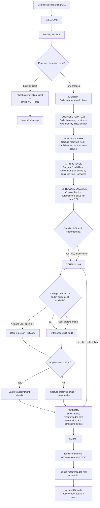

# StorenTech AI — Prospect Intake Question Flow

## Overview
One-question-at-a-time conversational intake for storentechai.com prospects. Friendly, professional, fast (~2 min).

---

## Mermaid Flowchart

## Flow Notes

- `PAIN_DISCOVERY` should focus on repetitive work, missed opportunities, bottlenecks, and lost revenue caused by inefficiencies.
- `AI_INFERENCE` is where the assistant uses business type plus interview answers to surface likely automation opportunities even when the user only names one pain point.
- `ROI_RECOMMENDATION` should rank the likely opportunities and explain which automation should be tackled first.
- Scheduling should bias toward an in-person ROI audit for Orange County prospects when feasible; otherwise it should default to phone unless the user asks for something else.
- `SUBMIT` must produce an operator-ready handoff email to `vincent@storentech.com`.

---

## Flow

### 1. WELCOME
> "Hi there! 👋 Welcome to StorenTech AI. We help businesses unlock their potential with AI-powered solutions. Let's get to know you so we can figure out how to help."
>
> **[Get Started]**

### 2. MODE_SELECT
> "Are you a new prospect or an existing client?"
>
> **[I'm New Here]** · **[Existing Client]**

*(Existing clients → OTP auth flow)*

---

### 3. IDENTITY
> "Great! Let's start with the basics."
>
> - **Full Name** (required)
> - **Work Email** (required, validated)
> - **Phone** (optional) — "In case we need to reach you quickly"

### 4. BUSINESS_CONTEXT
> "Tell us about your business."
>
> - **Company Name** (required)
> - **Business Type** (recommended): `Plumber` · `Service Business` · `Retail` · `Manufacturing` · `Healthcare` · `Professional Services` · `Other`
> - **Industry** (optional chips): `E-commerce` · `Healthcare` · `Finance` · `Real Estate` · `Marketing` · `SaaS` · `Other`
> - **Company Size** (optional chips): `Just me` · `2-10` · `11-50` · `51-200` · `200+`
> - **Primary Location / Service Area** (recommended) to help route in-person vs phone ROI audit scheduling

### 5. NEEDS
> "What are you looking to accomplish with AI?"
>
> - **What repetitive work or lost-business issues are hurting most right now?** (textarea, required)
>   - Placeholder: *"e.g., Automate customer support, build an AI chatbot, analyze data, streamline workflows..."*
>
> - **What type of solution interests you?** (chips, optional):
>   `AI Chatbot` · `Workflow Automation` · `Data Analysis` · `Custom AI App` · `AI Strategy / Consulting` · `Not Sure Yet`
>
> - **Timeline** (chips):
>   `ASAP` · `This Month` · `Next Quarter` · `Just Exploring`
>
> - **Budget Range** (chips):
>   `Under $5k` · `$5k–$15k` · `$15k–$50k` · `$50k+` · `Not Sure`
>
> - **AI follow-up guidance after answer capture**
>   - infer 3 to 5 likely automation pain points from business type + interview answers
>   - suggest which automation should be fixed first for the strongest ROI
>   - recommend a deeper ROI audit when several pain points or unclear process losses appear

### 6. SCHEDULING (optional — can be skipped)
> "Want to book a detailed ROI audit? It's the fastest way to decide what automation to fix first."
>
> **Option A:** [Book a Time →] *(opens Calendly/booking link)*
> "Already booked? **[I Booked a Time]**"
>
> **— or —**
>
> **Option B:** Share your availability
> - **Preferred times** (textarea): *"e.g., Tue/Thu afternoons, mornings EST"*
> - **Timezone** (dropdown)
> - **Preferred contact method** (chips): `Phone` · `In Person` · `Email`
> - **Routing rule:** prefer `In Person` when the business is in Orange County, CA and a slot is available; otherwise default to `Phone`, unless the user asks for something else
>
> **[Skip This Step]**

### 7. SUMMARY
> "Here's what we've got — look good?"
>
> *(Shows summary card with all captured info)*
> *(Editable textarea for corrections/additions)*
> *(Attachment upload: PNG, JPEG, PDF)*
>
> **[Submit]**

### 8. SUBMIT
> "Thanks, [First Name]! 🎉 We've received your info and will be in touch within 1 business day. Keep an eye on your inbox."
>
> *(Optional: show social links or resource)*
>
> **Operational handoff**
> - Email the interview summary to `vincent@storentech.com`
> - Include the recommended first automation to pursue
> - Include ROI audit appointment details if one is booked or requested

---

## UX Notes
- **One question at a time** — chat bubble style, scrolling conversation
- **Quick reply chips** reduce typing friction
- **Progress indicator** shows step count + estimated time
- **"End & Send Now"** button always available as escape hatch
- **Mobile-first** — single column, large tap targets
- **Brand colors:** TBD (need StorenTech AI brand guidelines)
- **Tone:** Warm, professional, not robotic. Like talking to a helpful human.

## Existing Client Fields (for reference)
When `mode=client`:
- OTP email auth
- Project selection
- Request type: `Bug` · `Change` · `New Feature`
- Description, Impact, Urgency
- File attachments

## Next Iteration Guidance
- The AI should recognize business-type patterns such as plumber, field service, retail, manufacturing, and similar categories.
- The AI should suggest 3 to 5 likely automation pain points, not just wait for the user to name one.
- The AI should rank likely pain points by ROI and recommend the first automation to solve.
- If the intake reveals multiple inefficiencies or unclear process losses, the assistant should push toward a detailed ROI audit rather than a generic intro call.
